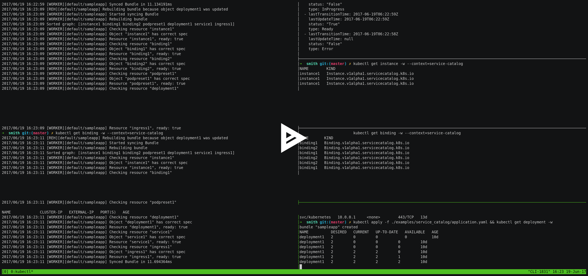

# Service Catalog example

## Description

Imagine that we want to deploy a service to Kubernetes, which consists of:
- Running application instances
- Postgres database, SQS queue
- Load balancer


For provisioning resources in AWS we can use [Service Catalog](https://github.com/kubernetes-incubator/service-catalog).
It allows us to provision resources through [Open Service Broker API](https://github.com/openservicebrokerapi/servicebroker) 
and produce Kubernetes Secret objects which we can inject into the Pods using PodPresets.

The resulting graph of Kubernetes and Service Catalog objects consists of:
- Pods for running application instances
- PodPresets referencing Secrets and injecting them into Pods
- Service Catalog Instance and Binding objects
- Ingress and Service (don't confuse it with Service Catalog) objects for load balancing


## Problem

The objects in this graph should be created in particular order, in respect of dependencies between them (note: independent branches in the graph could be processed in parallel).
There is no built-in generic way in Kubernetes of making sure that the objects are created in a particular order. And **Smith** project was designed to solve exactly this problem.

## Demo

Smith Bundle declaring the graph described above (see [application.yaml](application.yaml)):

```yaml
apiVersion: smith.atlassian.com/v1
kind: Bundle
metadata:
  name: sampleapp
spec:
  resources:

  - name: instance1
    spec:
      apiVersion: servicecatalog.k8s.io/v1alpha1
      kind: Instance
      metadata:
        name: instance1
      spec:
        externalID: 786abffa-ed42-4c70-a06f-3836fe3d641c
        serviceClassName: user-provided-service
        planName: default
        parameters:
          credentials:
            token: token

  - name: binding1
    dependsOn:
    - instance1
    spec:
      apiVersion: servicecatalog.k8s.io/v1alpha1
      kind: Binding
      metadata:
        name: binding1
      spec:
        instanceRef:
          name: "{{instance1#metadata.name}}"
        secretName: secret1

  - name: binding2
    dependsOn:
    - instance1
    spec:
      apiVersion: servicecatalog.k8s.io/v1alpha1
      kind: Binding
      metadata:
        name: binding2
      spec:
        instanceRef:
          name: "{{instance1#metadata.name}}"
        secretName: secret2

  - name: podpreset1
    dependsOn:
    - binding1
    - binding2
    spec:
      apiVersion: settings.k8s.io/v1alpha1
      kind: PodPreset
      metadata:
        name: podpreset1
      spec:
        selector:
          matchLabels:
            role: app
        envFrom:
        - prefix: BINDING1_
          secretRef:
            name: "{{binding1#spec.secretName}}"
        - prefix: BINDING2_
          secretRef:
            name: "{{binding2#spec.secretName}}"

  - name: deployment1
    dependsOn:
    - podpreset1
    spec:
      apiVersion: apps/v1beta1
      kind: Deployment
      metadata:
        name: deployment1
      spec:
        replicas: 2
        template:
          metadata:
            labels: "{{{podpreset1#spec.selector.matchLabels}}}"
          spec:
            containers:
            - name: nginx
              image: nginx:latest
              ports:
              - containerPort: 80

  - name: service1
    dependsOn:
    - deployment1
    spec:
      apiVersion: v1
      kind: Service
      metadata:
        name: service1
      spec:
        ports:
        - port: 80
          protocol: TCP
          targetPort: 80
          nodePort: 30090
        selector: "{{{deployment1#spec.template.metadata.labels}}}"
        type: NodePort

  - name: ingress1
    dependsOn:
    - service1
    spec:
      apiVersion: extensions/v1beta1
      kind: Ingress
      metadata:
        name: ingress1
      spec:
        rules:
        - http:
            paths:
            - path: /
              backend:
                serviceName: "{{service1#metadata.name}}"
                servicePort: "{{{service1#spec.ports[?(@.protocol==\"TCP\")].port}}}"

```

### Screencast

[](https://asciinema.org/a/125263)
